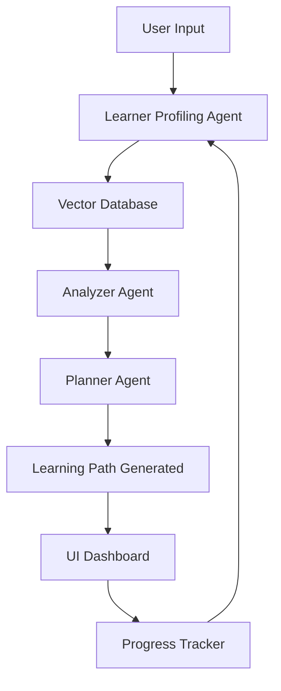

# System Architecture

## Architecture Overview

The Learning Path Recommender Agent follows a **multi-agent AI architecture** combining LLM reasoning, retrieval-augmented generation (RAG), vector search, and adaptive feedback loops.

The design ensures:

* Scalability
* Adaptability
* Continuous learning personalization
* Intelligent decision-making

This architecture behaves like an AI mentor that analyzes a learner, recommends courses, tracks progress, and dynamically updates learning paths.

---

## Core Architecture Components

### 1. Data Ingestion Layer

**Purpose:** Collect and process course data.

Includes:

* Course datasets (CSV/API/scraping)
* Course metadata extraction
* Text chunking for embeddings

**Why used:**

* Converts raw educational content into structured AI-ready format.
* Enables semantic understanding rather than simple keyword matching.

---

### 2. Embedding & Vector Database

**Tools:**

* Sentence Transformers / OpenAI embeddings
* FAISS or Chroma DB

**Purpose:**

* Semantic similarity search
* Course retrieval for recommendations

**Why used:**

* Enables contextual understanding beyond keywords.
* Fast retrieval from large course catalogs.

---

### 3. Learner Profiling Agent

**Responsibilities:**

* Analyze user skills and goals
* Embed learner profile
* Identify skill gaps

**Why used:**

* Creates personalized context for recommendations.
* Improves recommendation relevance.

---

### 4. Planning & Recommendation Agents

#### Analyzer Agent

* Retrieves relevant courses
* Detects missing prerequisites

#### Planner Agent

* Builds optimized learning sequence
* Considers time constraints and difficulty

#### Validator Agent (Optional)

* Ensures logical consistency of plans

**Why multi-agent approach:**

* Improves reasoning accuracy
* Mimics collaborative expert decision-making.

---

### ⭐ Difficulty Level Handling (Added Feature)

The system categorizes courses into:

* Beginner (Easy)
* Intermediate
* Advanced (Hard)

This helps:

* Match learner skill level accurately
* Prevent overwhelming beginners
* Provide progressive structured learning paths

Difficulty levels are considered during:

* Course retrieval
* Path planning
* UI recommendation display
* Adaptive replanning based on performance

---

### 5. Progress Tracking & Feedback Loop

Tracks:

* Completed courses
* User feedback
* Quiz performance

**Why used:**

* Enables adaptive replanning.
* Keeps roadmap updated dynamically.

---

### 6. User Interface Layer

Built using:

* Streamlit or Gradio
* Plotly for visualization

**Purpose:**

* Interaction, visualization, and control.
* Dashboard, chat assistant, weekly planning UI.

---

## Architecture Advantages

* Modular and extensible
* Supports real-time personalization
* Scalable to real course platforms
* Supports conversational AI workflows
* Adaptive difficulty-aware recommendations

---

## Architecture Diagram

This diagram shows how learner input flows through profiling, retrieval, planning, UI visualization, and continuous feedback for adaptive learning path updates.

---
